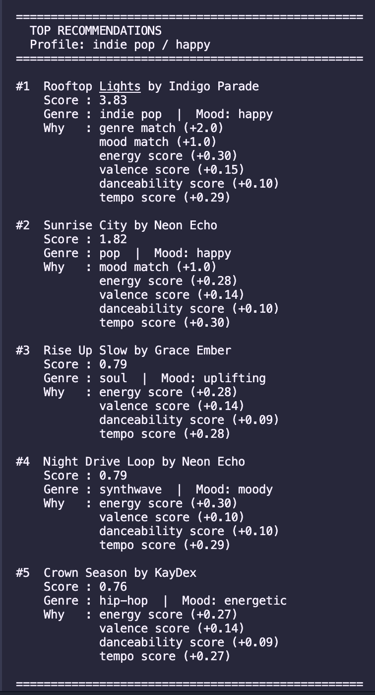
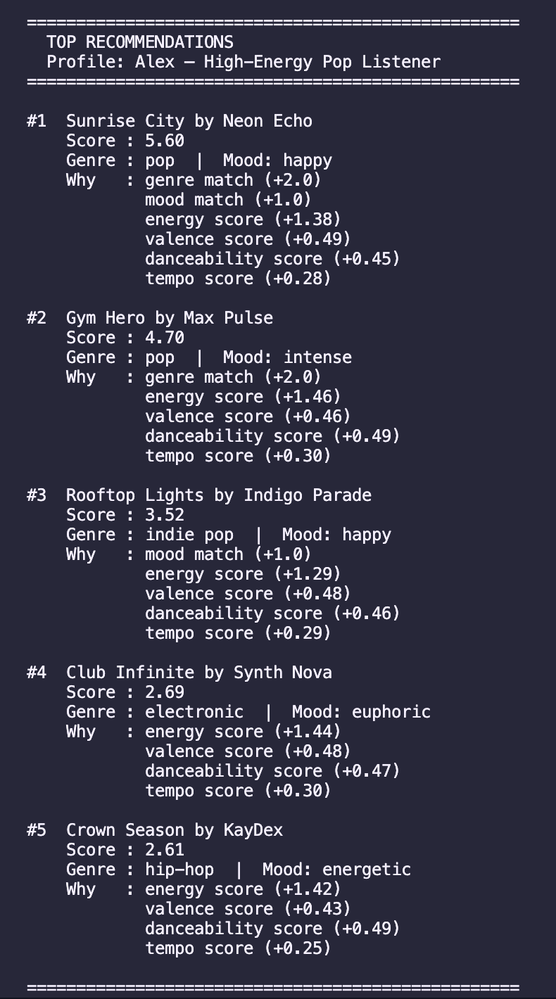
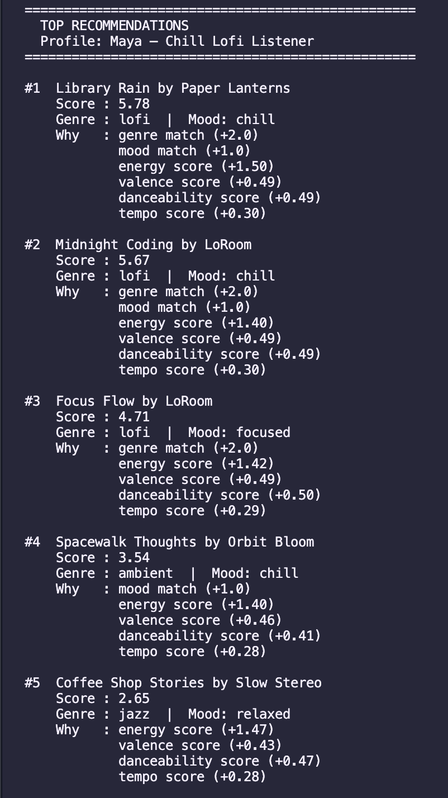
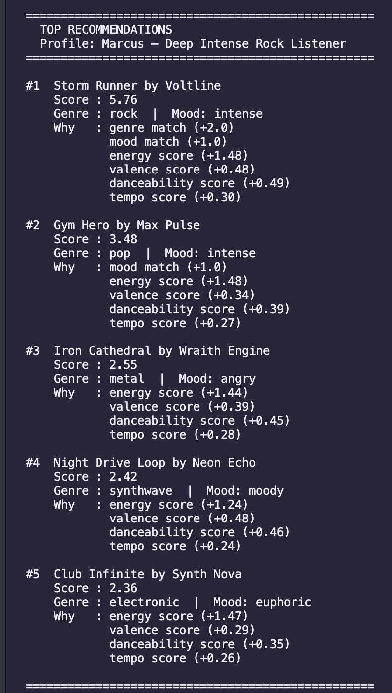
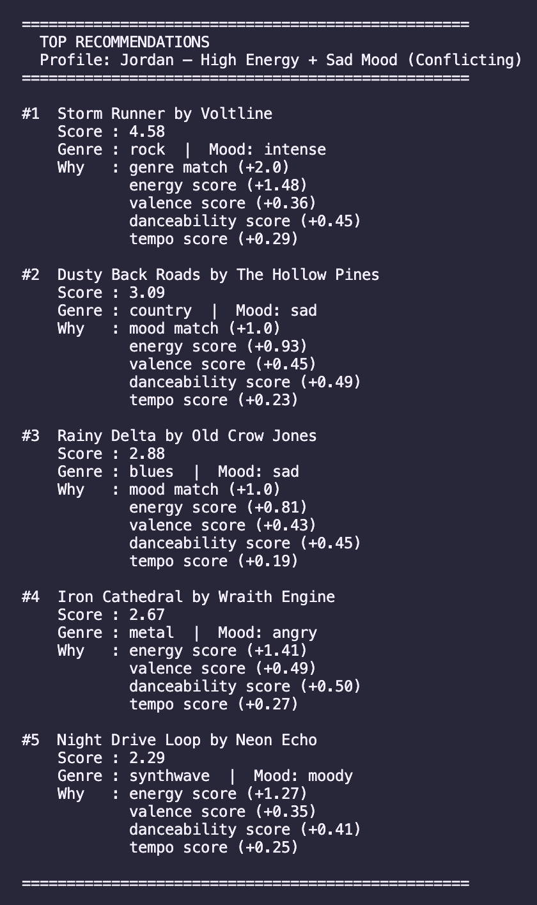
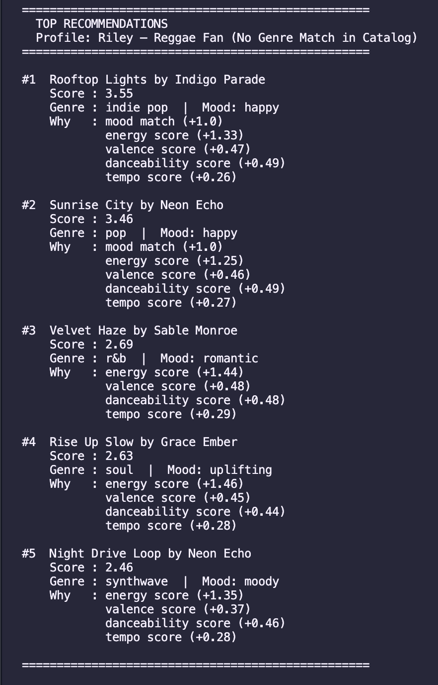
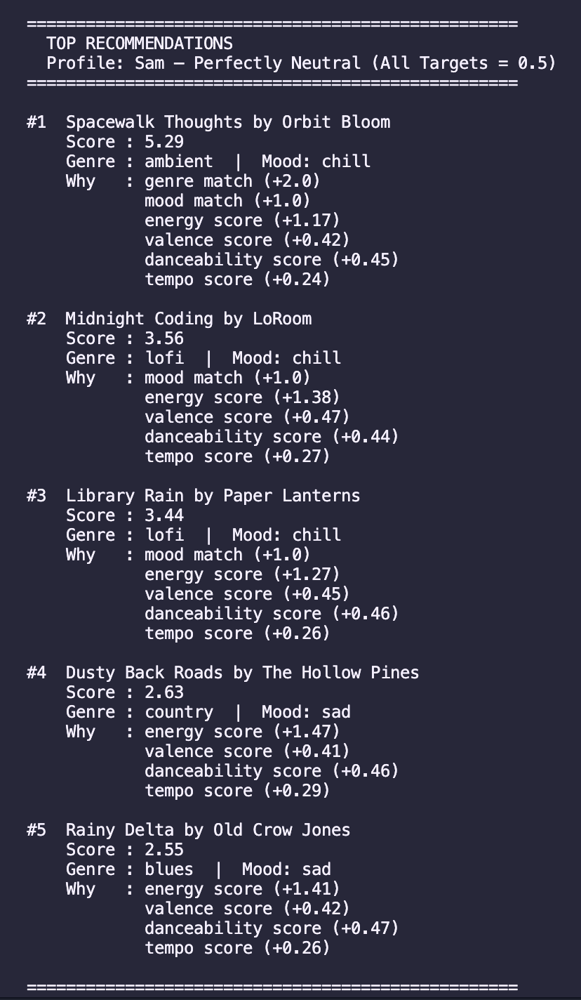

# 🎵 Music Recommender Simulation

## Project Summary

In this project you will build and explain a small music recommender system.

Your goal is to:

- Represent songs and a user "taste profile" as data
- Design a scoring rule that turns that data into recommendations
- Evaluate what your system gets right and wrong
- Reflect on how this mirrors real world AI recommenders

SoulMusic is a music recommender that takes a user's taste profile — their favorite genre, mood, and energy preferences — and scores every song in a catalog to find the best matches. Each song gets points based on how closely it lines up with what the user wants, and the top 5 results are returned with a short explanation of why each one ranked where it did. The project helped me understand how scoring rules turn raw data into predictions, where bias can creep in when certain features are weighted too heavily, and how real apps like Spotify likely use similar logic at a much larger scale.

---

## How The System Works

Explain your design in plain language.

Some prompts to answer:

- What features does each `Song` use in your system
  - For example: genre, mood, energy, tempo
- What information does your `UserProfile` store
- How does your `Recommender` compute a score for each song
- How do you choose which songs to recommend

You can include a simple diagram or bullet list if helpful.

This recommender works by taking what a user likes and comparing it to every song in the catalog. Each song gets a score based on how well it matches, and the top 5 results are returned with a short reason for each pick.

**Song features used in the system:**
- `genre` — the style of music (e.g. lofi, pop, rock, jazz)
- `mood` — the emotional feel (e.g. happy, chill, intense, moody)
- `energy` — how high-energy the song feels, from 0.0 to 1.0
- `valence` — how positive or upbeat it sounds, from 0.0 to 1.0
- `danceability` — how suited it is for dancing, from 0.0 to 1.0
- `acousticness` — how acoustic vs. produced it sounds, from 0.0 to 1.0
- `tempo_bpm` — the speed of the song in beats per minute

The system compares a user’s taste profile against every song in the catalog, scores each one, and returns the top 5.

**What the user profile stores:**
- Favorite genre and favorite mood
- Numerical targets for energy, valence, danceability, acousticness, and tempo

**How each song is scored:**
- Genre match adds 2 points — genre is weighted highest because it is the hardest preference boundary. If someone wants jazz, a rock song is a miss no matter how good the energy match is.
- Mood match adds 1 point — mood matters but is more forgiving than genre
- For each numerical feature, the system calculates `1 - abs(song_value - target_value)` and multiplies by a weight. Energy has the biggest weight (1.5) since it is the most immediately noticeable quality. Valence, danceability, acousticness, and tempo add smaller amounts on top.

**How recommendations are chosen:**
- Every song in the CSV gets scored
- They are sorted highest to lowest
- The top 5 are returned, each with a short explanation of why it ranked there

**Potential bias:** Genre has a strong pull in this system. A song in the right genre but wrong mood will usually outscore a song with the perfect mood but a different genre — meaning some good matches can get buried. With only 18 songs in the catalog, genres that appear just once (like country or metal) will almost always surface regardless of how poorly the rest of the features match.
---

## Getting Started

### Setup

1. Create a virtual environment (optional but recommended):

   ```bash
   python -m venv .venv
   source .venv/bin/activate      # Mac or Linux
   .venv\Scripts\activate         # Windows

2. Install dependencies

```bash
pip install -r requirements.txt
```

3. Run the app:

```bash
python -m src.main
```

### Running Tests

Run the starter tests with:

```bash
pytest
```

You can add more tests in `tests/test_recommender.py`.

---

## Experiments You Tried

Use this section to document the experiments you ran. For example:

- What happened when you changed the weight on genre from 2.0 to 0.5
- What happened when you added tempo or valence to the score
- How did your system behave for different types of users

I tested six user profiles to evaluate the system. The high-energy pop listener got mostly pop results, though electronic and hip-hop songs crept in due to close energy scores. The chill lofi listener worked best — all three lofi songs ranked in the top three because the genre bonus and numerical targets reinforced each other. For the intense rock listener, a pop song with the "intense" mood label surprisingly outranked a metal song. The adversarial profile with high energy and a sad mood exposed a real weakness: the genre bonus outweighed the mood mismatch, so the top result was a rock song that was not sad at all. When I used a genre not in the catalog like reggae, no song earned the genre bonus and the rankings felt random. Finally, with all targets set to 0.5, the single ambient song dominated just because it was the only one to earn the genre bonus.

---

## Limitations and Risks

Summarize some limitations of your recommender.

Examples:

- It only works on a tiny catalog
- It does not understand lyrics or language
- It might over favor one genre or mood

You will go deeper on this in your model card.

- The catalog only has 18 songs, so the results feel repetitive fast. A few songs like Gym Hero and Rooftop Lights show up across multiple profiles just because no better option exists.
- Genre gets too much power. If your favorite genre is in the catalog, that song almost always wins — even if the mood or energy is a bad match.
- Acousticness is tracked but never used in scoring, so two people with totally different texture preferences will get the same results.
- If your genre is not in the catalog at all (like reggae), the system has nothing personal to offer and just guesses based on numbers.
- The system does not understand context. It cannot tell the difference between someone who wants chill background music while studying vs. someone who wants slow sad music to cry to — both might have similar settings but want very different things.

---

## Reflection

Read and complete `model_card.md`:

[**Model Card**](model_card.md)

Write 1 to 2 paragraphs here about what you learned:

- about how recommenders turn data into predictions
- about where bias or unfairness could show up in systems like this

Building this made me realize that a recommender is really just a point system in disguise. It does not actually "know" what good music is — it just adds up numbers based on rules you set. If you tell it genre is worth 2 points and mood is worth 1, it will follow that math every single time, even when the result feels wrong to a real person. The system is only as smart as the weights you give it, and small choices like making genre worth twice as much as mood end up shaping every single recommendation.

The bias part surprised me the most. I did not expect that a missing genre (like reggae) would give that user a totally different and worse experience than everyone else. Or that a song like Gym Hero — which is really made for working out — would keep showing up for people who just want happy background pop, just because it shares the "pop" label and has high energy. Real apps like Spotify probably have the same problem at a bigger scale, just hidden behind millions of songs. The more I looked at the results, the more I noticed the system was rewarding whatever was easy to measure, not whatever actually matched the vibe.

---

## 7. `model_card_template.md`

Combines reflection and model card framing from the Module 3 guidance. :contentReference[oaicite:2]{index=2}  

```markdown
# 🎧 Model Card - Music Recommender Simulation

## 1. Model Name

Give your recommender a name, for example:

> SoulMusic 
---

## 2. Intended Use

- What is this system trying to do
- Who is it for

Example:

> SoulMusic is a music recommender that suggests songs based on your mood, favorite genre, and how you want a song to feel — things like energy level, how danceable it is, and how fast or slow it should be. It generates a ranked list of the top 5 songs from the catalog that best match what you are looking for.

> The system assumes the user already knows what kind of music they like and can describe it — it does not learn from listening history or past behavior. It also assumes there is a song in the catalog that is a reasonable match, which is not always true given how small the dataset is.

> This app is meant for classroom exploration, not real users. It is a learning project built to understand how recommender systems work under the hood. It has known limitations — like a small catalog and genre bias — so it should not be used to actually guide someone's music taste in a real-world setting.

---

## 3. How It Works (Short Explanation)

Describe your scoring logic in plain language.

- What features of each song does it consider
- What information about the user does it use
- How does it turn those into a number

Try to avoid code in this section, treat it like an explanation to a non programmer.

> Every song in the catalog gets a score based on how well it matches what a user says they like. The system looks at genre, mood, energy, how danceable the song is, how positive it sounds (valence), and how fast it is (tempo). The user tells the system their favorite genre and mood, and also sets targets for energy, danceability, and tempo on a scale from 0 to 1.

> Genre is worth the most — if a song matches your favorite genre it gets 2 bonus points right away. Mood match gives 1 bonus point. After that, the system checks how close each song's energy, danceability, and valence are to your targets. The closer the match, the more points it adds. Tempo is also checked but only adds a tiny amount.

> Once every song is scored, they get sorted from highest to lowest, and the top 5 are shown with a short reason explaining why each one ranked where it did.

---

## 4. Data

Describe your dataset.

- How many songs are in `data/songs.csv`
- Did you add or remove any songs
- What kinds of genres or moods are represented
- Whose taste does this data mostly reflect

> The catalog has 18 songs stored in a CSV file. Each song has a genre, mood, and numerical values for energy, tempo, valence, danceability, and acousticness.

> Genres included: pop, lofi, rock, indie pop, ambient, jazz, synthwave, hip-hop, country, classical, metal, r&b, blues, soul, and electronic. Moods included: happy, chill, intense, focused, moody, sad, relaxed, energetic, melancholic, angry, romantic, euphoric, and uplifting.

> No songs were added or removed from the original dataset. The catalog is small and mostly covers mainstream western genres — it is missing reggae, Latin, K-pop, funk, and many others. It also only has one or two songs per genre, so variety within a genre is basically zero. The data reflects a pretty narrow slice of musical taste overall.

---

## 5. Strengths

Where does your recommender work well

You can think about:
- Situations where the top results "felt right"
- Particular user profiles it served well
- Simplicity or transparency benefits

> The system works best when a user has a clear and specific taste — someone who knows exactly what genre they want and has a strong energy preference. For example, Maya (chill lofi) and Marcus (intense rock) both got results that felt accurate right away because their preferences pointed clearly in one direction and matching songs existed in the catalog.

> It also does a good job of showing its reasoning. Every recommendation comes with a breakdown of exactly why each song ranked where it did, which makes it easy to understand and spot when something feels off. That transparency is something a lot of real apps don't give you.

> For users whose genre is well represented in the catalog, the top result is almost always a logical pick. The genre and mood bonuses together do a decent job of locking onto the right vibe quickly.

---

## 6. Limitations and Bias

Where does your recommender struggle

Some prompts:
- Does it ignore some genres or moods
- Does it treat all users as if they have the same taste shape
- Is it biased toward high energy or one genre by default
- How could this be unfair if used in a real product

> **Findings from experiment:**

> **Genre takes over everything.** If a song matches your favorite genre, it almost always lands at #1 — no matter what. Even if a song from a different genre is a way better fit for your energy or mood, it still loses. The system basically just picks your genre and stops thinking.

> **Acousticness is collected but completely ignored.** The system asks how acoustic you like your music, and the songs even have that info — but the code never actually uses it. So it doesn't matter if you want soft acoustic guitar or heavy synths, the score comes out the same either way.

> **Energy can drown out mood.** When we turned up the energy weight during the experiment, the system started recommending angry metal songs to a user who wanted sad music — just because the energy level happened to match. The system doesn't check if the vibe actually makes sense together.

> **Too few songs means too little variety.** There are only 18 songs in the catalog, with about one or two per genre. If your favorite genre isn't in there at all (like reggae), the system has no idea what to do with you and just guesses based on numbers. That's a pretty unfair experience compared to someone whose genre is included.

> **Tempo barely matters.** Tempo — how fast or slow a song is — is worth almost nothing in the final score compared to energy. So even if you want a slow, chill 70 BPM song and the system gives you something at 140 BPM, that huge difference barely changes the result.

---

## 7. Evaluation

How did you check your system

Examples:
- You tried multiple user profiles and wrote down whether the results matched your expectations
- You compared your simulation to what a real app like Spotify or YouTube tends to recommend
- You wrote tests for your scoring logic

> I ran seven different listener profiles through the system to see if the results made sense.

> The ones that worked fine were Alex (pop lover), Maya (lofi fan), and Marcus (rock fan). They all got songs that matched what they asked for, which felt right.

> The weird ones were more interesting. Jordan wanted rock music but in a sad mood — there are sad songs in the list (a country one and a blues one), but no sad rock song. So the system gave Jordan a rock/intense song at #1 because the genre matched, then fell back on the country and blues sad songs for #2 and #3. The sad mood got answered, just not in the right genre. That felt a little off.

> Riley wanted reggae, which is not in the list at all. The system had no idea what to do, so it just picked songs that had similar energy and speed. The songs were fine but not really reggae.

> Sam had all their settings at 0.5 (perfectly in the middle) and ended up with sad country and blues songs in the bottom of the list — just because those songs happened to have energy close to 0.5. That was a surprise and didn't feel like a good fit.

> When I changed the weights (made energy stronger, made genre weaker), the #1 song never changed for anyone. The system is pretty stubborn about its top pick.


---

## 8. Future Work

If you had more time, how would you improve this recommender

Examples:

- Add support for multiple users and "group vibe" recommendations
- Balance diversity of songs instead of always picking the closest match
- Use more features, like tempo ranges or lyric themes

> Since SoulMusic is still a classroom project with known bugs and limitations, there is a lot of room to grow. I would improve it by adding more music types, letting users save or build their own playlists from their results, and making tempo count more in the scoring so the speed of a song actually affects what gets recommended.

> - **Add more music types.** The catalog only has 18 songs and is missing a lot of genres people actually listen to — like reggae, Latin, K-pop, and funk. Adding more variety would make SoulMusic feel less repetitive and more useful for people with different tastes.
> - **Let users save and build playlists.** Right now the system just shows a list and that's it. It would be way more useful if users could save their top results, name a playlist, and come back to it later — more like how a real music app works.
> - **Make tempo count more.** Tempo is almost ignored in the current scoring. Someone who wants slow chill music at 70 BPM should not be getting fast hype songs just because the energy matched. Giving tempo more weight would help SoulMusic understand the vibe better — like the difference between a study playlist and a workout playlist.

---

## 9. Personal Reflection

A few sentences about what you learned:

- What surprised you about how your system behaved
- How did building this change how you think about real music recommenders
- Where do you think human judgment still matters, even if the model seems "smart"

> I learned that this type of scoring algorithm is probably used in a lot of other apps and websites too — anything with a "recommended for you" feature is likely doing something similar, just with way more data. I also learned that the conditions and rules you set matter a lot depending on what kind of recommendation you are trying to make. Small decisions like how much weight to give genre vs. mood completely change what the user sees.

> Something I found interesting was how diverse a single song can actually be. A pop song with a high tempo can still be sad, and a slow quiet song can feel happy — a lot of musical features can go in unexpected directions. That made me realize that labeling music with just one mood or genre is kind of an oversimplification, and a real recommender would need a lot more nuance to get it truly right.

---

## Screenshot outputs 

~ Phase 3 ~ 

The output showing the recommendations (song titles, scores, and reasons): 




~ Phase 4 ~

The output for each profile's recommendations:

**Profile: Alex — High-Energy Pop Listener**



---

**Profile: Maya — Chill Lofi Listener**



---

**Profile: Marcus — Deep Intense Rock Listener**



---

**Profile: Jordan — High Energy + Sad Mood (Conflicting / Adversarial)**



---

**Profile: Riley — Reggae Fan (No Genre Match in Catalog)**



---

**Profile: Sam — Perfectly Neutral (All Targets = 0.5)**




**Profile Comparisons:** 

**Alex (High-Energy Pop) vs. Maya (Chill Lofi)**
These two got completely different results, which makes sense. Alex wants loud, fast, danceable pop — so she got Sunrise City and Gym Hero. Maya wants slow, quiet, calm music — so she got Library Rain and Midnight Coding. They have nothing in common in their top 5, which is exactly what you'd expect from two people with opposite tastes.

**Alex (High-Energy Pop) vs. Marcus (Intense Rock)**
These two both want high energy, but different genres. Alex got pop songs and Marcus got rock songs. The interesting part is Gym Hero (a pop song that is very loud and intense) showed up for Marcus too, because the energy and mood matched even though it's not rock. This shows that when a song is extreme enough in one feature, it can sneak into lists it doesn't quite belong in.

**Why does Gym Hero keep showing up for Happy Pop listeners?**
Gym Hero is tagged as pop, which means it instantly gets bonus points for any pop listener. It also has very high energy and danceability, so even when someone just wants light happy pop, the system sees "pop genre — give it points" and slides Gym Hero in. The system doesn't know the difference between gym music and chill background pop. To it, pop is pop.

**Maya (Chill Lofi) vs. Sam (Perfectly Neutral)**
Maya had clear preferences and got a focused lofi list. Sam had no real preferences — everything was set to the middle — and got a random mix of ambient, lofi, and even sad country songs. This shows that the system works best when it has something strong to aim at. When you give it nothing, it just grabs whatever happens to land near the middle numerically, and the results feel random.

**Marcus (Intense Rock) vs. Jordan (Rock but Sad)**
Both wanted rock, so both got Storm Runner at #1. But Marcus wanted intense and got more high-energy metal and synth in his list. Jordan wanted sad, and while the system couldn't find sad rock, it did pull in country and blues sad songs for #2 and #3. The genre locked in the top spot, but the mood shaped the rest of the list.

**Jordan (Rock/Sad) vs. Riley (Reggae, No Genre Match)**
Jordan at least got a genre match at #1. Riley got nothing — reggae isn't in the catalog — so the whole list was built on energy and tempo numbers alone. Riley ended up with indie pop and pop songs that happen to feel similar in speed and energy to reggae. The results aren't terrible but they feel generic, like the system just gave up on finding something personal.